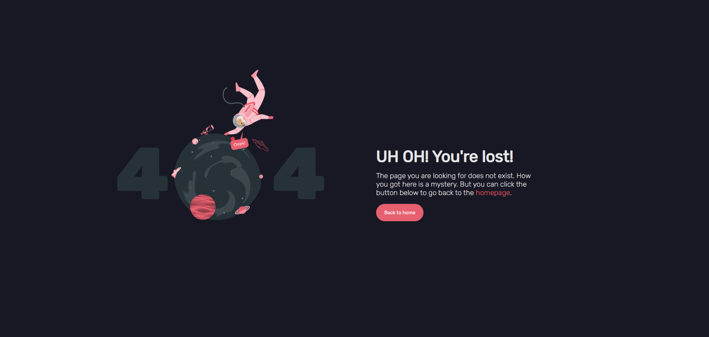
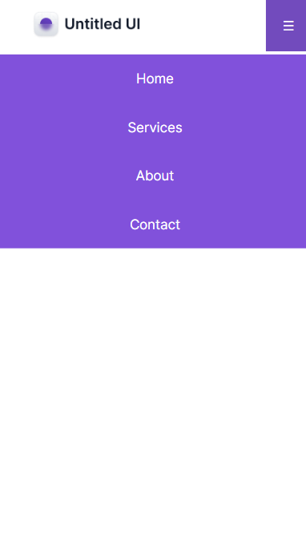

# 21-dias-de-codigo-rocketseat
Repo criado para o desafio de 21 dias de código com a Rocketseat 🚀

- [x] Dia 01: Criar um repositório
- [x] Dia 02: Criar um Hello World customizado
- [x] Dia 03: Criar um botão animado
- [x] Dia 04: Criar uma calculadora
- [x] Dia 05: Desenvolver uma página com erro 404
- [x] Dia 06: Criar um card com efeito glassmorphism
- [x] Dia 07: Desenvolver um contador
- [x] Dia 08: Desenvolver um toggle 
- [x] Dia 09: Criar uma animação de loading
- [x] Dia 10: Utilizar a lib Particle.js 
- [x] Dia 11: Criar um layout de um form de login
- [x] Dia 12: Desenvolver uma galeria de fotos
- [x] Dia 13: Desenvolver um menu responsivo
- [x] Dia 14: Criar um form de quizzes
- [x] Dia 15: Desenvolver um e-commerce 
- [x] Dia 16: Desenvolver um site com uma API 
- [x] Dia 17: Desenvolver um site que capture eventos do teclado
- [x] Dia 18: Desenvolver um gerador de senhas 
- [x] Dia 19: Desenvolver um site que gere imagens utilizando a API do unsplash
- [ ] Dia 20: Desenvolver um site de emoji picker
- [ ] Dia 21: ...

## Dia 02: "Hello World" customizado

 

## Dia 03: Botão animado

 

## Dia 03: Calculadora

 

## Dia 05: Página com erro 404

 

## Dia 06: Card com efeito glassmorphism 

 

## Dia 07: Contador

 

## Dia 08: Toggle

 

 

## Dia 09: Animação de loading

 

## Dia 10: Particle.js 

 

## Dia 11: Form de login

 

## Dia 12: Galeria de imagens

 

## Dia 13: Menu responsivo

 

 

## Dia 14: Form de quizzes

 

## Dia 15: E-commerce

 

## Dia 16: API Pública

 

## Dia 17: Eventos do teclado

 

## Dia 18: Gerador de senhas

 

## Dia 19: Site que gere imagens utilizando a API do unsplash

 

